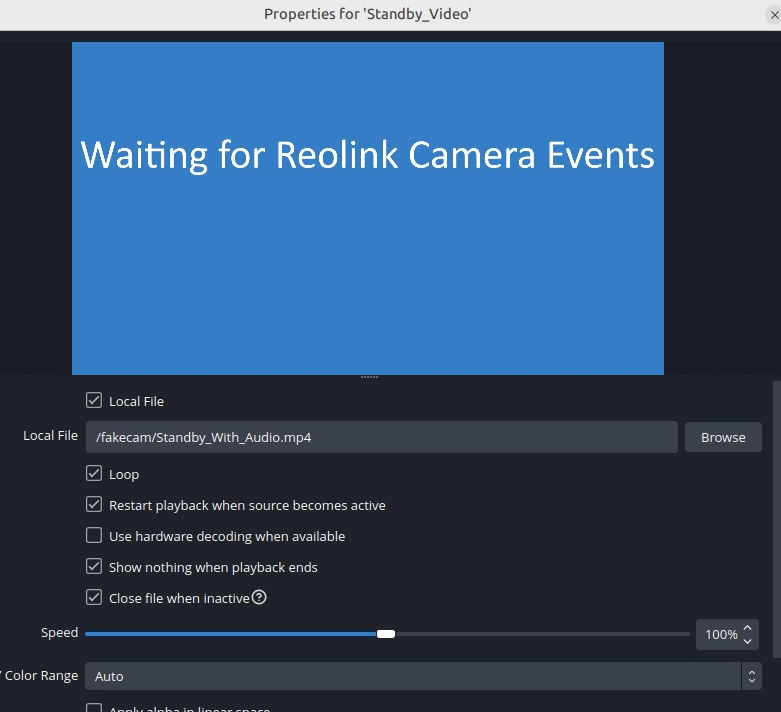
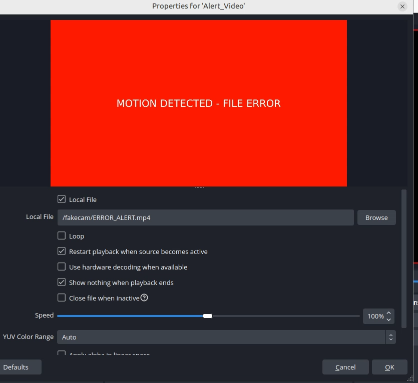
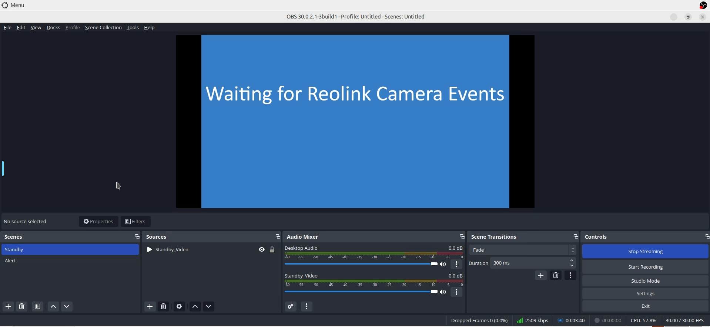

# OBS Setup

Tested with: OBS `30.0.2.1-3build1` (inside the LinuxServer Webtop container).

## 1. Accessing the OBS Interface
Because OBS is running inside a "Webtop" container, you don't open a local app. Instead, open your web browser and navigate to:

**URL:** `https://<your-server-ip>:3001`

Note: You will see a certificate warning (self-signed). Click "Advanced" and "Proceed." You are now looking at a Linux desktop inside your browser.

Cancel the wizard setup if prompted for the first time. 

## 2. Initial OBS Setup (The "Compositor")
Once inside the Webtop desktop, open OBS Studio from the application menu. If you don't see it in the menu, open xterm and run `obs`.

Configure these three essential pieces:

### A. The Scenes
Create two specific scenes (names must match exactly for the monitor.py script):

#### "Standby"
This is your default view. 
- Create a scene that contains a Media Source named "Standby_Video":
    - Local File: CHECKED
    - Path: {path to your "Waiting".mp4} (e.g., `/fakecam/Standby_With_Audio.mp4`)
    - Loop: CHECKED <--- CRITICAL!!!
    - Restart playback when source becomes active: CHECKED
    - Use hardware decoding: Optional (depends on your setup; I'm not helping you debug hardware acceleration).
    - Show nothing when playback ends: CHECKED
    - Close file when inactive: CHECKED <--- CRITICAL!!!

    

#### "Alert"
- Create a scene that contains a Media Source named "Alert_Video":
    - Local File: CHECKED
    - Path: {path to your ERROR_ALERT.mp4} (e.g., `/fakecam/ERROR_ALERT.mp4`)
    - Loop: NOT CHECKED
    - Restart playback when source becomes active: CHECKED
    - Use hardware decoding: Optional (depends on your setup; I'm not helping you debug hardware acceleration).
    - Show nothing when playback ends: CHECKED
    - Close file when inactive: NOT CHECKED <--- CRITICAL!!!

    

### B. The WebSocket 
Go to Tools > WebSocket Server Settings:
- Enable WebSocket Server.
- Set the port to 4455 (default).
- Disable "Authentication" (since it's only listening on 127.0.0.1) or set a password and update it in your monitor.py.

Note: OBS WebSocket is built into newer OBS versions. If you're using an older OBS build that does not include WebSocket support, you may need to install the obs-websocket plugin.

    

### C. The Output (MediaMTX Link)
Go to File > Settings > Stream:
- Service: Custom...
- Server: `rtmp://127.0.0.1:1935/live`

Set your **Stream Key** in the same screen (this is what becomes part of the RTSP path in Blue Iris). Example stream keys: `reolink`, `driveway`, `backyard`.

### D. Optional - Audio settings
Go to File / Settings
    > Audio.
        Sample Rate: Change to 44.1 kHz

        * I had audio issues initially changing this setting fixed them YMMV